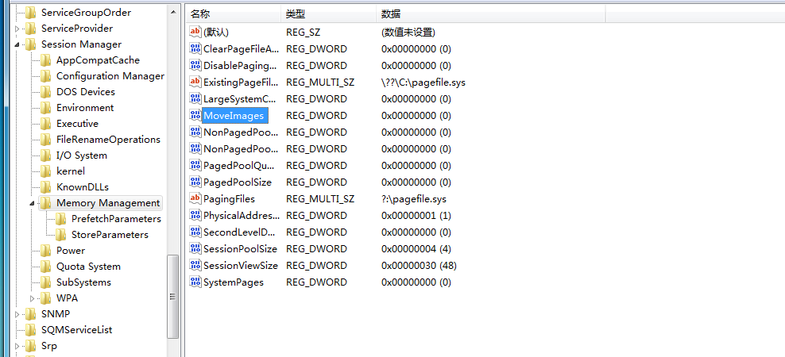

## details

More details will public after my final exam on my [blog](https://redogwu.github.io/).

## repeat

-   Adobe version:  2019.012.20034
    -   URL: ftp://ftp.adobe.com/pub/adobe/reader/win/AcrobatDC/1901220034/
-   windows version: windows 7 sp1 x64

This is a UAF vulerability. The exploit code could poc a `calc.exe` after disable the ASLR.

>   If u want to bypass ASLR, the information leak bug is needed. You need to leak the `AcroForm.api` base address.

-   Step 00: disable sandbox

-   Step 01: disable ASLR

In my local machine, when I disable the ASLR. The `AcroForm.api's` base address is `0x20800000`. You could edit it in the exploit code.

## proof of concept

>   Note: I use a strange way to achive heap fengshui, so it is a little not stable. Maybe you should tri it more than once.

## To do list

-   Need to find a information leak bug to bypass the ASLR.
-   Need to bypass the sandbox, I will use [cve-2019-17236]().
    -   Achived the exploit code for LPE, need more work to know how to use it bypass sandbox.
-   Need to make it more stable.
-   Need to exploit it on windows 10.
-   Need to understand, If it is the first time see the related code. How can I build the poc code. 
